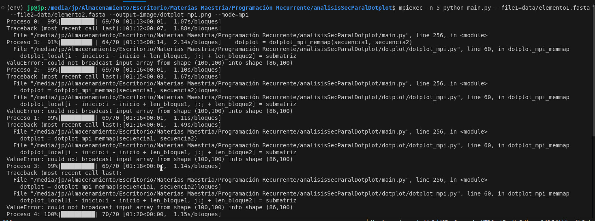
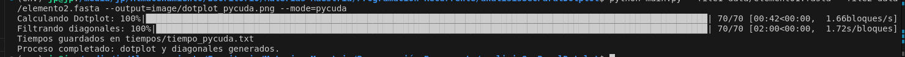

# Análisis de Rendimiento de Implementaciones Paralelas para la Generación de Dotplots Genómicos

## Descripción del Proyecto

Este proyecto tiene como objetivo analizar el rendimiento de diferentes implementaciones para la generación de dotplots, una técnica ampliamente utilizada en bioinformática para comparar secuencias de ADN o proteínas. Se desarrollaron cuatro versiones del algoritmo:

1. **Implementación Secuencial**: Método base sin paralelismo.
2. **Implementación con Multiprocessing**: Paralelización en un solo nodo utilizando múltiples procesos.
3. **Implementación con MPI (mpi4py)**: Paralelización distribuida en múltiples nodos.
4. **Implementación con GPU (PyCUDA)**: Aceleración mediante el uso de GPUs.

El proyecto incluye un análisis de rendimiento basado en métricas como tiempos de ejecución, aceleración, eficiencia y escalabilidad. Los resultados se presentan en un informe en formato IEEE.

---

## Arquitectura de Carpetas

La estructura del repositorio es la siguiente:

📂 analisisSecParalDotplot  
├── 📂 data  
│   └── fasta_utils.py            # Utilidades para manejar archivos FASTA  
├── 📂 dotplot  
│   ├── __init__.py               # Archivo de inicialización del paquete  
│   ├── dotplot_mpi.py            # Implementación con MPI (mpi4py)  
│   ├── dotplot_multiprocessing.py # Implementación con multiprocessing  
│   ├── dotplot_pycuda.py       # Implementación con PyCUDA (GPU)  
│   ├── dotplot_sequential.py   # Implementación secuencial  
│   ├── fasta_utils.py          # Funciones para manejo de archivos FASTA  
│   └── image_filter.py         # Filtros para mejorar la calidad del dotplot  
├── 📂 image  
│   ├── dotplot.png             # Dotplot generado (ejemplo)  
│   ├── dotplot_ultimate.png    # Dotplot final optimizado  
│   ├── dotplot_mpi.png         # Resultado del dotplot con MPI  
│   ├── dotplot_multiprocess.png # Resultado del dotplot con multiprocessing  
│   ├── dotplot_pycuda.png      # Resultado del dotplot con PyCUDA  
│   └── dotplot_secuencial.png  # Resultado del dotplot secuencial
├── main.py                     # Archivo principal para ejecutar el proyecto  
├── README.md                   # Documentación del proyecto  
├── requirements.txt            # Dependencias del proyecto  


## Requisitos

Antes de ejecutar el proyecto, asegúrate de cumplir con los siguientes requisitos:

### Dependencias de Software
- **Python 3.8 o superior**
- **Bibliotecas de Python** (instalables desde `requirements.txt`):
  - `numpy`
  - `matplotlib`
  - `mpi4py`
  - `pycuda`
- **MPI (Message Passing Interface)**:
  - Instalar OpenMPI o MPICH para ejecutar la implementación con `mpi4py`.
- **Controladores CUDA**:
  - Asegúrate de tener instalados los controladores de NVIDIA y CUDA Toolkit para ejecutar la implementación con PyCUDA.

### Instalación de Dependencias
Ejecuta el siguiente comando para instalar las dependencias necesarias:

```bash
pip install -r requirements.txt
```

### Cómo Ejecutar el Proyecto

El proyecto incluye una aplicación de línea de comandos que permite generar dotplots utilizando diferentes modos de ejecución 
secuencial, multiprocessing, mpi4py y PyCUDA. A continuación, se describen los comandos para ejecutar cada modo.

#### Parámetros del Comando

##### `--file1` (obligatorio)
Ruta al archivo FASTA que contiene la primera secuencia a comparar.  
**Ejemplo:** `data/elemento1.fasta`

##### `--file2` (obligatorio)
Ruta al archivo FASTA que contiene la segunda secuencia a comparar.  
**Ejemplo:** `data/elemento2.fasta`

##### `--output` (obligatorio)
Ruta y nombre del archivo de salida donde se guardará la imagen del dotplot generado.  
**Ejemplo:** `image/dotplot_pycuda.png`

##### `--mode` (obligatorio)
Modo de ejecución para generar el dotplot. Las opciones disponibles son:  
- `secuencial`: Para ejecutar el algoritmo en un solo núcleo (sin paralelismo).  
- `multiprocessing`: Para utilizar múltiples procesos en un solo nodo.  
- `mpi`: Para paralelizar el cálculo en múltiples nodos usando `mpi4py`.  
- `pycuda`: Para acelerar el cálculo mediante GPU usando `PyCUDA`.  

**Ejemplo:** `--mode=mpi`


#### Modo PyCUDA (GPU)
```bash
python main.py --file1=data/elemento1.fasta --file2=data/elemento2.fasta --output=image/dotplot_pycuda.png --mode=pycuda
```

#### Modo Secuencial
```bash
python main.py --file1=data/elemento1.fasta --file2=data/elemento2.fasta --output=image/dotplot_secuencial.png --mode=secuencial
```
#### Modo MPI
```bash
python main.py --file1=data/elemento1.fasta --file2=data/elemento2.fasta --output=image/dotplot_mpi.png --mode=mpi
```

#### Modo Multiprocessing
```bash
python main.py --file1=data/elemento1.fasta --file2=data/elemento2.fasta --output=image/dotplot_multiprocessing.png --mode=multiprocessing
```

### Resultados






